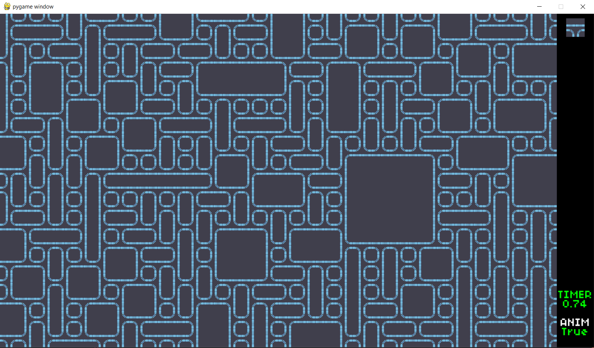

# Wave-Function-Collapse
A Basic (5 directional) WFC implementation in pygame 

# USAGE
**`Left/Right`** click : **Place/Delete** Block

*`-- Note: Due to a visual bug, you can only place a block only if it is the first block on the screen (clear the screen before placing the block). --`*

**`C`** : Clear the screen

**`SPACE`** : Start the alogrithm and start **generating**

**`Wheel up/down`** : Change the **block type**

*`-- Eg: pipes, polka,... --`*

**`CTRL + Wheel up/down`** : Change the **block variant**

**`H`** : Turn **`ON/OFF`** block **animation**

# MODIFICATIONS
+ Change the tile-size at **`Main.py`** **( follow the comment )**
+ Change the rule sets at **`Algo.py`** **( follow the comment )**

# RESULT


# REQUIRMENTS
```PYTHON
PYGAME (2.4.0 or higher)
```


